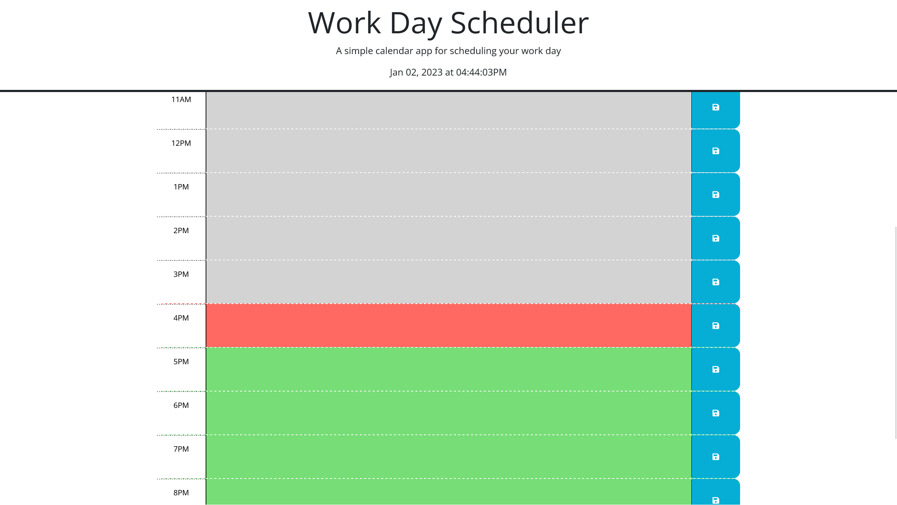

# Daily Calendar Application

## Description

This is a small web app meant to organize a daily todo list. Entries can be made by the hour into the text area of each time block, saved, and recalled from local storage upon page reload.

## Installation

No installation is necessary.

## Usage

Load the page and click on a specific text area to input your hourly tasks. Once entered click on the save button to the right of reach text area to save you tasks. 

If the page is closed and reloaded tasks can be retrieved from local storage, as long as the user data is not cleared. You may need to turn off clearing data on you browser upon closing the browser. 

https://jacob-jeffries.github.io/m5c/

## Credits

I utilizied the following API's:

* jQuery: https://jquery.com/
* Day.js: https://day.js.org/

## License

MIT License

Copyright (c) [2022] [Jacob Jeffries]

Permission is hereby granted, free of charge, to any person obtaining a copy
of this software and associated documentation files (the "Software"), to deal
in the Software without restriction, including without limitation the rights
to use, copy, modify, merge, publish, distribute, sublicense, and/or sell
copies of the Software, and to permit persons to whom the Software is
furnished to do so, subject to the following conditions:

The above copyright notice and this permission notice shall be included in all
copies or substantial portions of the Software.

THE SOFTWARE IS PROVIDED "AS IS", WITHOUT WARRANTY OF ANY KIND, EXPRESS OR
IMPLIED, INCLUDING BUT NOT LIMITED TO THE WARRANTIES OF MERCHANTABILITY,
FITNESS FOR A PARTICULAR PURPOSE AND NONINFRINGEMENT. IN NO EVENT SHALL THE
AUTHORS OR COPYRIGHT HOLDERS BE LIABLE FOR ANY CLAIM, DAMAGES OR OTHER
LIABILITY, WHETHER IN AN ACTION OF CONTRACT, TORT OR OTHERWISE, ARISING FROM,
OUT OF OR IN CONNECTION WITH THE SOFTWARE OR THE USE OR OTHER DEALINGS IN THE
SOFTWARE.